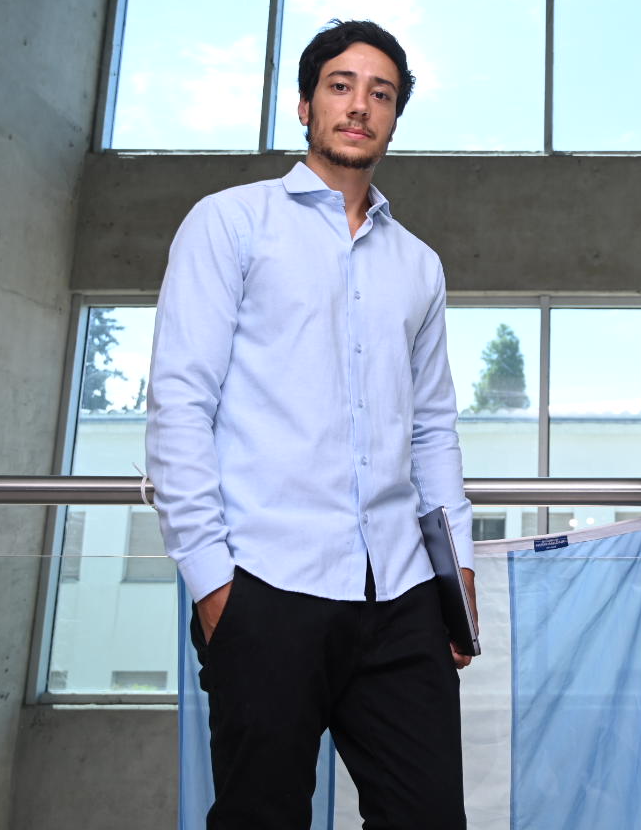

# Lautaro Di Bartolo

## About me :rocket:

I am an **industrial engineer** graduated from the National University of Mar del Plata, pursuing a **PhD in science and technology** at the National University of Cuyo.

I am currently working as **data scientist** for [Analytics Town](https://www.analyticstown.com/en/home/) on e-commerce sites of a large retail company in Europe. In addition, I work as a **CRM consultant** (HubSpot) for [Deitres](https://www.deitres.com), an IoT firm, seeking the automation of marketing and collection tools. Finally, I have teaching functions at the National University of Mar del Plata as an **assistant professor** in **applied statistics**.

**I am interested in carrying out projects that involve the entire data life cycle**:
* Data creation, ingestion, or capture.
* Data processing.
* Data analysis.
* Data sharing, publication and visualization.

## Education :books:

### PhD in science and technology - National University of Cuyo (Argentina)
`April 2021 -> December 2024`

Topic: high performance computational biology.

Scientific publications:
* [Synaptotagmin-1 C2B domains cooperatively stabilize the fusion stalk via a master-servant mechanism](https://pubs.rsc.org/en/content/articlehtml/2022/sc/d1sc06711g). Chemical Science. 2022. **Di Bartolo Ary Lautaro** and Masone Diego.
* [Enhanced Expansion and Reduced Kiss-and-Run Events in Fusion Pores Steered by Synaptotagmin-1 C2B Domains](https://pubs.acs.org/doi/abs/10.1021/acs.jctc.2c00424). Journal of Chemical Theory and Computation. **Di Bartolo Ary Lautaro**, Tomes Claudia, Mayorga Luis and Masone Diego.

In media:
* [Describing how a key protein for neuronal synapses works.](https://www.uncuyo.edu.ar/prensa/ciencia-argentina-describen-como-funciona-una-proteina-clave-para-la-sinapsis-neuronal23)

* [Supercomputing and neural connections.](https://ccad.unc.edu.ar/2022/03/29/serafin-supercomputacion-y-conexiones-neuronales/)

### Industrial engineering - National University of Mar del Plata (Argentina)
`March 2015 -> August 2020` 

GPA: 8.06 of 10

Academic experiences:
* Undergraduate research fellow at the Scientific Research Commission of the Province of Buenos Aires, Argentina.
* Undergraduate teaching assistant at the National University of Mar del Plata.

## Job experience :coffe:

### Data scientist - Analytics Town
`May 2022 - Today`

Part of the e-commerce team responsible for collecting data, processing it and generating reports/insights for a large retail company in Europe. Working under the Agile methodology and the Google Cloud Platform environment.

Aptitudes: `Google Analytics`, `Python`, `BigQuery`, `Virtual Machines`, `Data Studio`, `GitHub`, `Bash Scripting` and `Linux`

### CRM consultant - Deitres
`April 2021 - Today`

Maintenance and improvements of implemented CRM (HubSpot) for the automation of the process of sales, collections and production.

Aptitudes: `HubSpot` and `Automated Marketing`

### Graduate teaching assistant - National University of Mar del Plata
`June 2022 - Today`

Applied statistics

### PhD Fellow - CONICET
`April 2021 - May 2022`

Doctoral scholarship to exclusively investigate the fusion pore in lipid membranes using high-performance computing techniques.

Aptitudes: `C++`, `Python`, `GitHub`, `Bash Scripting`, `Linux`, `High Performance Computing` and `Scientific Investigation`

### Pricing Analyst - Accenture
`November 2020 - April 2021`

Generation of pricings for projects in LATAM, USA, Canada and Europe. Development of an application to standardize the pricing request process using low-code with Power Apps connected to a SharePoint database using Power Automate. A dashboard displayed in Power BI made it possible to track the use of this tool.

Aptitudes: `Microsoft Excel`, `Microsoft Power Apps`, `Microsoft Power Automate`, `Microsoft Power BI` and `Microsoft SharePoint`.

### Product Analyst - Deitres
`February 2020 - November 2020`

Product development, marketing and planning. Management of logistics, suppliers, purchases and contracts. Financial analysis. Implementation of CRM (HubSpot).

Aptitudes: `HubSpot`, `Product Management`, `Marketing` and `Finance`

## Contact me

:mailbox: Email: [lautarodibartolo@gmail.com](mailto:lautarodibartolo@gmail.com)

:boom: LinkedIn: [linkedin.com/in/lautarodibartolo](https://www.linkedin.com/in/lautarodibartolo/)

:smirk_cat: GitHub: [github.com/lautarodibartolo](https://github.com/lautarodibartolo)
